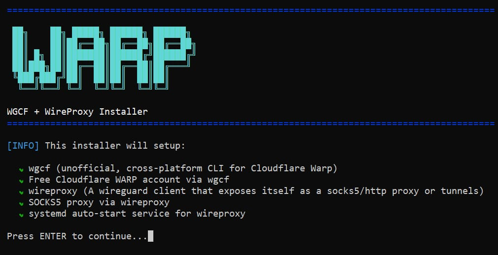

# WGCF + WireProxy Installer

<div dir="auto">

یک اسکریپت ساده نصب و راه‌اندازی [wgcf](https://github.com/ViRb3/wgcf) و [wireproxy](https://github.com/windtf/wireproxy) و ارائه کانکشن داخلی وارپ برای **دبیان** و **اوبونتو**

## چرا؟

معمولاً کانکشن وارپ داخل [3X-UI](https://github.com/MHSanaei/3x-ui) باگ داره برام و مجبورم دستی این مسیر رو طی کنم تا کانکشن وارپ پایدار داشته باشم. برای راحتی یه اسکریپت ساده نوشتم که همه کارها رو با چندتا انتخاب کوچیک خودش انجام می‌ده و گفتم اینجا هم بگذارم اگه کسی خواست استفاده کنه. از این برای راه‌اندازی بک‌اند ساکس برای مثلا [GooseRelayVPN](https://github.com/Kianmhz/GooseRelayVPN) هم می‌تونید استفاده کنید.

## نصب

```bash
bash <(curl -sL https://raw.githubusercontent.com/MHShokuhi/wgcf-wireproxy-installer/main/install.sh)
```
## تصویر منو اصلی



## مراحل کار

پس از اجرای دستور بالا در خط فرمان، با زدن اینتر می‌توانید مراحل نصب را آغاز کنید.

اسکریپت از شما پورت مورد نظرتان را می‌پرسد (عددی بین `1024` تا `65535`) که پیش‌فرض آن `40000` است و بهتر است با زدن اینتر از همین مقدار استفاده کنید.

پس از نصب پیش‌نیازها، اسکریپت بدون دخالت کاربر اقدام به دریافت wgcf از گیت‌هاب کرده، با اتصال به کلودفلر یک اکانت وارپ رایگان ساخته و اطلاعات کانکشن وایرگارد موردنظر را تولید می‌کند. سپس با دریافت wireproxy از گیت‌هاب، اقدام به ساخت یک فایل کانفیگ برای براساس اطلاعات وایرگارد دریافتی از wgcf کرده و تغییراتی برای اجبار به استفاده از `IPv4` اعمال می‌کند (گاهی وارپ `IPv6` رفتار عجیب‌وغریب در 3X-UI و بعضی سایت‌ها دارد). اسکریپت در نهایت اقدام به ساخت سرویس `systemd` کرده تا پروکسی وارپ ما حتی پس از ریستارت سیستم نیز فعال بماند.

در صورت موفقیت‌آمیز بودن همه مراحل تا اینجا، مشخصات کانکشن ساکس و چند دستور مورد نیاز نمایش داده شده و از کاربر پرسیده می‌شود که آیا می‌خواهد صحت اتصال را چک کند، که با زدن اینتر یا `Y` می‌توان این کار را انجام داد. **پیشنهاد می‌شود این کار همیشه انجام شود زیرا گاهی کلودفلر با تاخیر به هندشیک اولیه پاسخ داده و با ریستارت سرویس یا نصب دوباره حل خواهد شد.**

در صورت استفاده دوباره از دستور نصب و تشخیص نصب بودن wireproxy، اسکریپت به شما امکان نصب دوباره یا تغییر تنظیمات و یا حذف کامل همه فایل‌ها را می‌دهد.

## سلب مسئولیت

این اسکریپت فقط برای اهداف آموزشی، آزمایشی و پژوهشی ارائه شده است.

<br />

MIT 

</div>